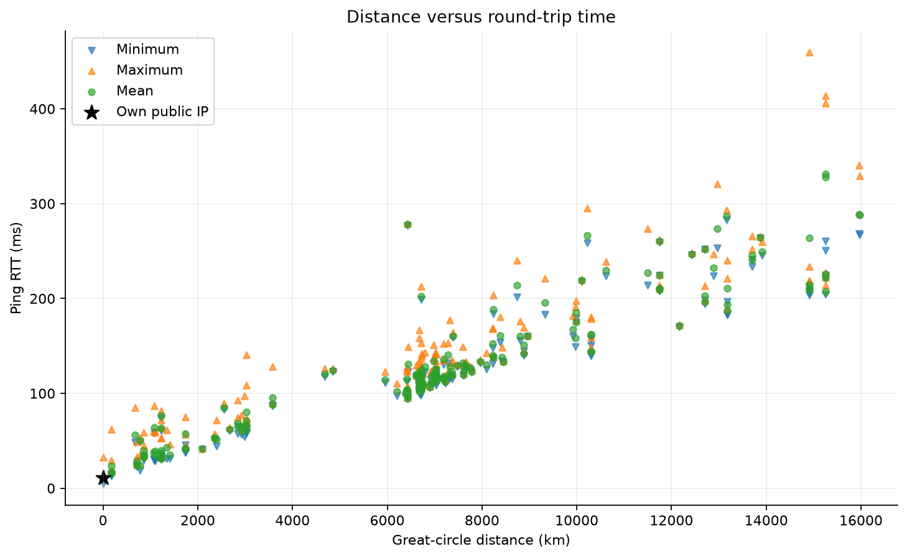
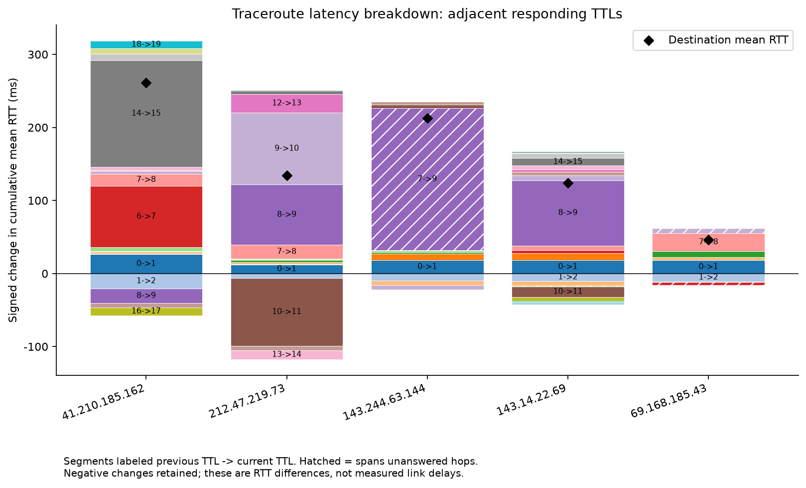
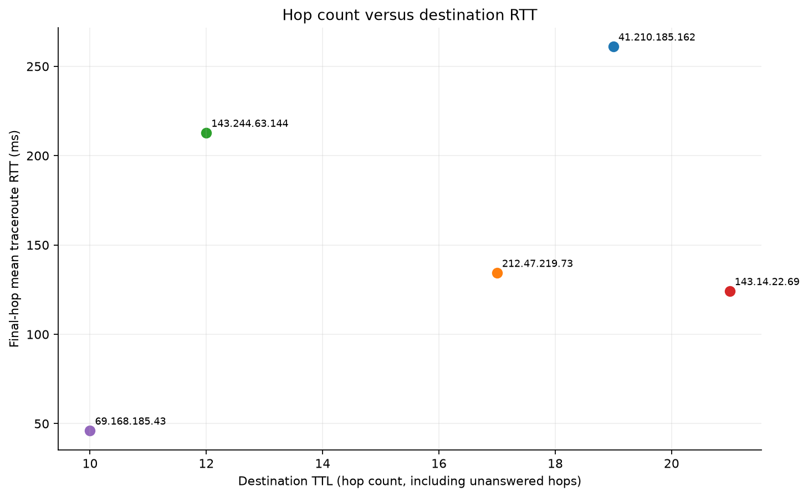

# Assignment 1: Network Latencies, Ping & Traceroute

## Assignment 1: Network Latencies, Ping & Traceroute

Bhavin Gupta | CS 422: Computer Networks | Fall 2026

Repository: https://github.com/bvin02/CS42200-Fall26-Assignment1

The experiment completed the full ping list and five traceroutes.

Measurement location: Purdue University, West Lafayette, IN. Public IP: 173.230.6.130. Coordinates used for distance: 40.42370, -86.92120.

I used the server list from https://iperf3serverlist.net/api/servers, sent 5 pings per IP, and used 3 probes per traceroute hop. Seed 422 controls the random traceroute selection.

Rerun command: ./run.sh --origin-label "Purdue University, West Lafayette, IN" --origin-lat 40.4237 --origin-lon -86.9212 --repo-url https://github.com/bvin02/CS42200-Fall26-Assignment1

Code sections: experiment.py:78 (fetch); experiment.py:129 (ping_ip); experiment.py:154 (geolocate); experiment.py:147 (haversine); experiment.py:193 (trace_ip); experiment.py:168 (parse_trace); experiment.py:325 (render). Raw command output is in results/raw.

## 1. Ping results and distance

I tested 188 unique IP addresses, including my public IP. 184 responded and 4 did not. The plot contains the 184 addresses with both RTT and coordinates. Missing replies are not treated as zero.

My public IP averaged 11.194 ms and is shown at zero distance as a local reference.

The plot compares great-circle distance with minimum, average, and maximum RTT. The Pearson correlation between distance and average RTT was 0.929, excluding my own IP.

The nearest geolocated responding server was 185.93.1.65 at 170 km with 23.25 ms mean RTT; the farthest was 157.66.210.199 at 15971 km with 288.09 ms. The largest observed min-to-max spread was 250.75 ms at 96.45.44.87 (208.70 to 459.45 ms).

RTT usually increased with distance, but distance was not the only factor. Internet routes are not straight lines, and processing, link speed, and queueing also add delay.

Minimum RTT is the best baseline seen during the test. Maximum RTT includes the worst delay seen. A large min-max gap shows that network conditions changed between packets.

Coordinates came from ipwho.is and are approximate. The full data is in the appendix and results/ping.csv.

## 2. Traceroute results and hop count

I shuffled the IP list with seed 422 and tried addresses until five destinations responded. 5 paths were attempted and 5 completed.

41.210.185.162: 19 hops, 260.99 ms; 212.47.219.73: 17 hops, 134.28 ms; 143.244.63.144: 12 hops, 212.70 ms; 143.14.22.69: 21 hops, 124.10 ms; 69.168.185.43: 10 hops, 46.02 ms

Asterisks are unanswered hops. A trace only counts when the final destination responds. Hop count is the final TTL, including unanswered intermediate hops.

The stacked chart subtracts each responding hop RTT from the next responding hop RTT. Hatched bars cross unanswered hops. The black diamond shows the destination RTT.

There were 22 negative differences. Each traceroute probe is a different packet, so queueing and return paths can vary. A negative bar is measurement variation, not negative link delay.

The correlation between hop count and final RTT was 0.365. There are only five paths, so this result only describes this run.

The largest destination TTL was 21 for 143.14.22.69, with 124.10 ms RTT. The highest RTT was 260.99 ms for 41.210.185.162 at 19 hops. These are different paths: more hops did not imply the highest RTT in this sample.

More hops can add delay, but hop count alone does not predict RTT. A few long links can take more time than many short links. Route length and queueing also matter.

## Full ping measurements

See `ping.csv` for all IPs, coordinates, min/mean/max RTT, loss and errors.
